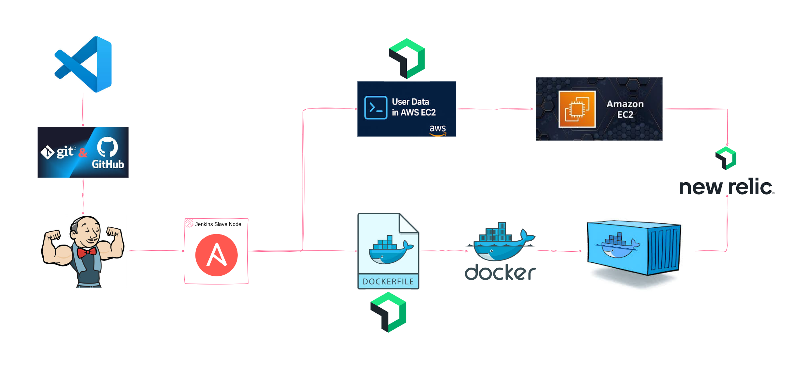

# 🚀 Jenkins + Ansible Deployment with New Relic Integration ⚡ 

Automated **CI/CD pipeline** leveraging **Jenkins** and **Ansible** to deploy applications on **AWS EC2** and **Docker containers**, seamlessly integrated with **New Relic** for full-stack observability and proactive monitoring. 🛠️📊

---

## 🧱 Architecture

> ✅ VS Code → GitHub → Jenkins → Ansible → NewRelic Deploy at Infra Setup time

---

## 📌 Overview
This project demonstrates a **DevOps workflow** that automates application deployment into two environments:  
1️⃣ **AWS EC2 Instance**  
2️⃣ **Docker Container**  

Both deployment pipelines include **New Relic integration**, enabling real-time insights into infrastructure and application performance. 🔍💡

---

## ⚙️ Tech Stack
- 🖥️ **Jenkins** – CI/CD automation
- 🤖 **Ansible** – Deployment automation
- ☁️ **AWS EC2** – Cloud infrastructure
- 📦 **Docker** – Containerization
- 📊 **New Relic** – Monitoring & observability
- 🗂️ **GitHub** – Source code management

---

## 🔄 Pipeline Workflow

### 1️⃣ AWS EC2 Deployment
1. Jenkins clones the GitHub repository.  
2. Ansible provisions the EC2 instance.  
3. **User Data script** installs and configures the New Relic Infrastructure Agent for monitoring. 🖥️📡  

### 2️⃣ Docker Container Deployment
1. Jenkins clones the GitHub repository.  
2. Docker image is built with embedded New Relic integration. 🐳📈  
3. Ansible deploys the container to the target server with monitoring enabled.  

---

## 🚀 Getting Started

### ✅ Prerequisites
- Jenkins installed and configured  
- Ansible installed  
- Docker installed (for container deployment)  
- New Relic API Key & Account ID  

### 🔑 Environment Variables & Secrets

- `NEW_RELIC_API_KEY`  
- `NEW_RELIC_ACCOUNT_ID`
-  `license_key`

### 📊 Monitoring
After deployment, you can view:  
- **Infrastructure Metrics** → New Relic Infrastructure  
- **Application Performance Data** → New Relic APM (if enabled)
 
---

## EC2 Integration with NewRelic

---

## Docker Container with NewRelic

---
